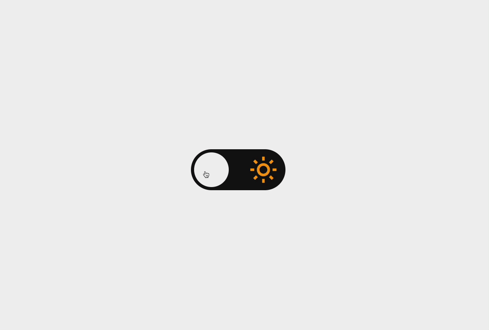

<h1 align="center"> Theme Switcher </h1>
 

  

## 💻 Projeto

Nesse desafio você deverá desenvolver uma página que contenha um toggle para alternar entre o tema dark e light.

## 🚀 Tecnologias

Esse projeto foi desenvolvido com as seguintes tecnologias:

- HTML e CSS
- JavaScript.
- Git e Github
- Figma
